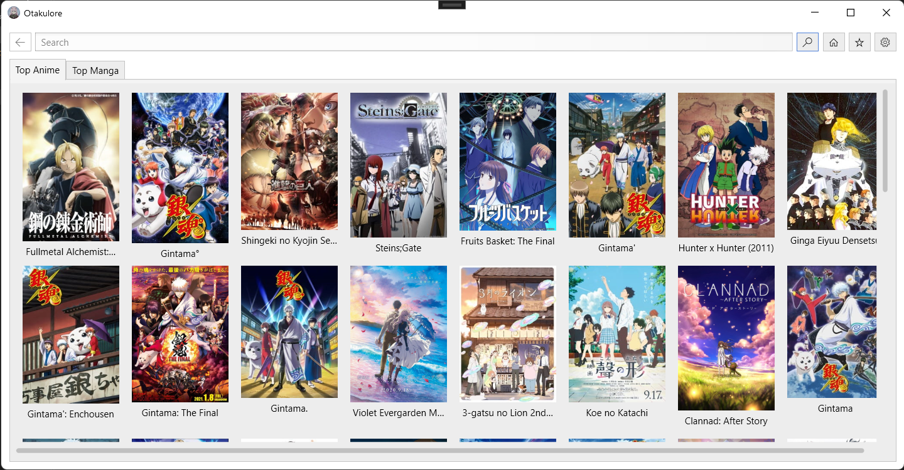
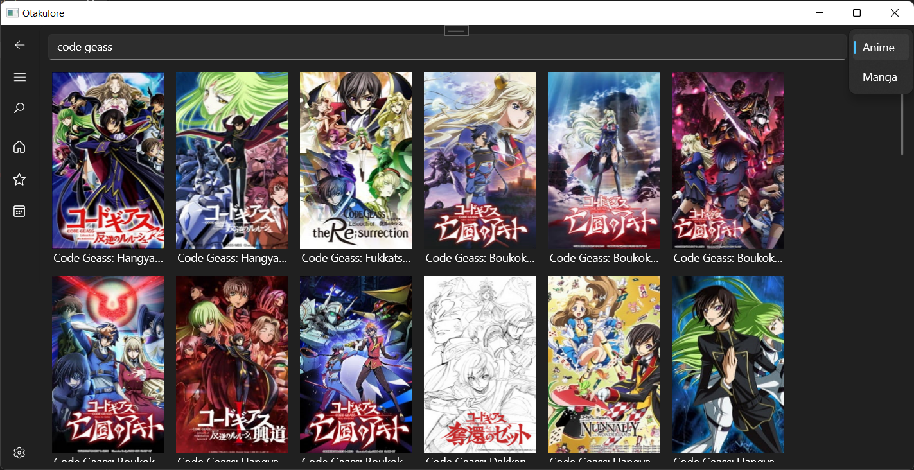
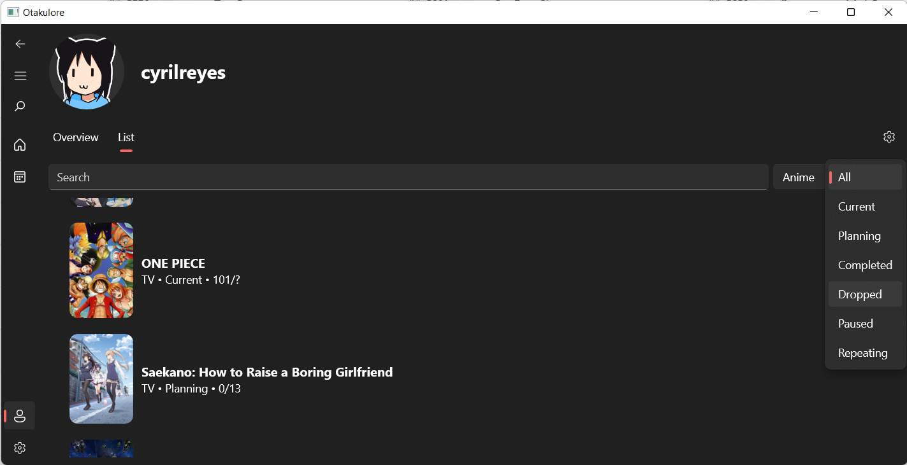
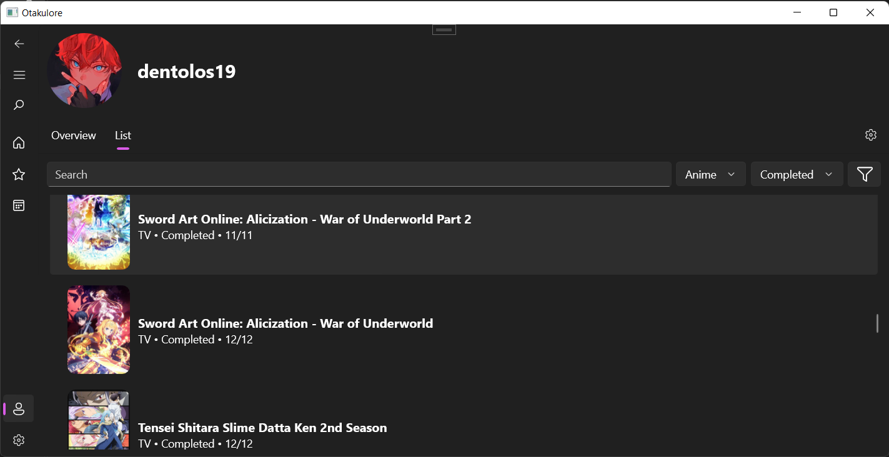
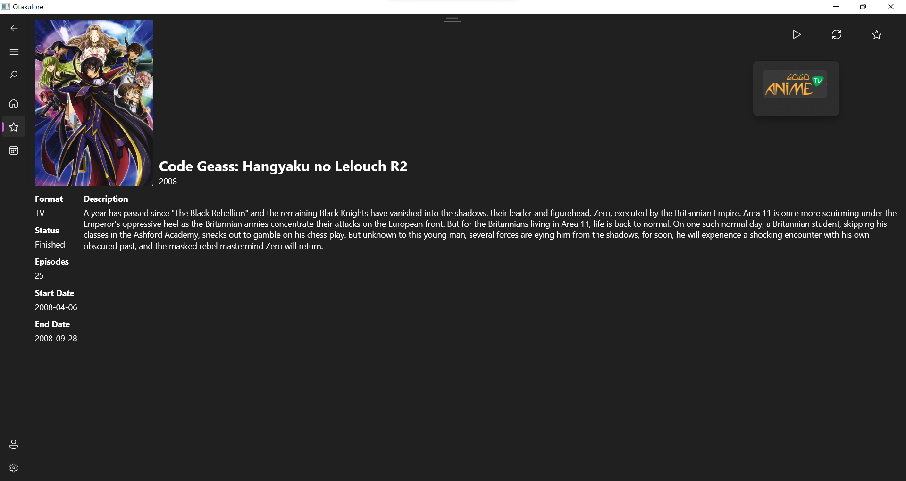
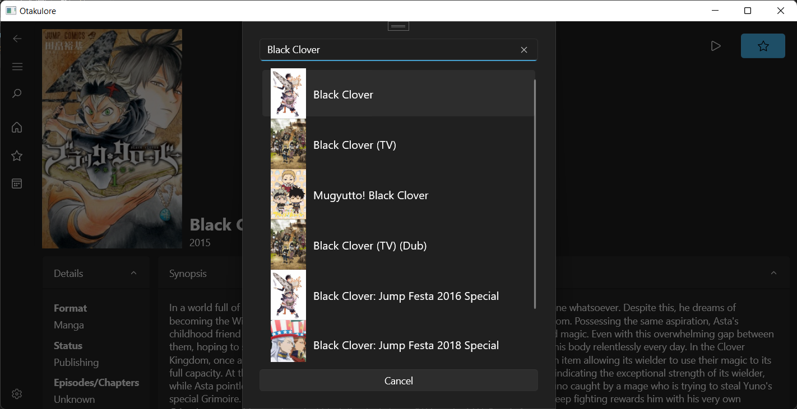
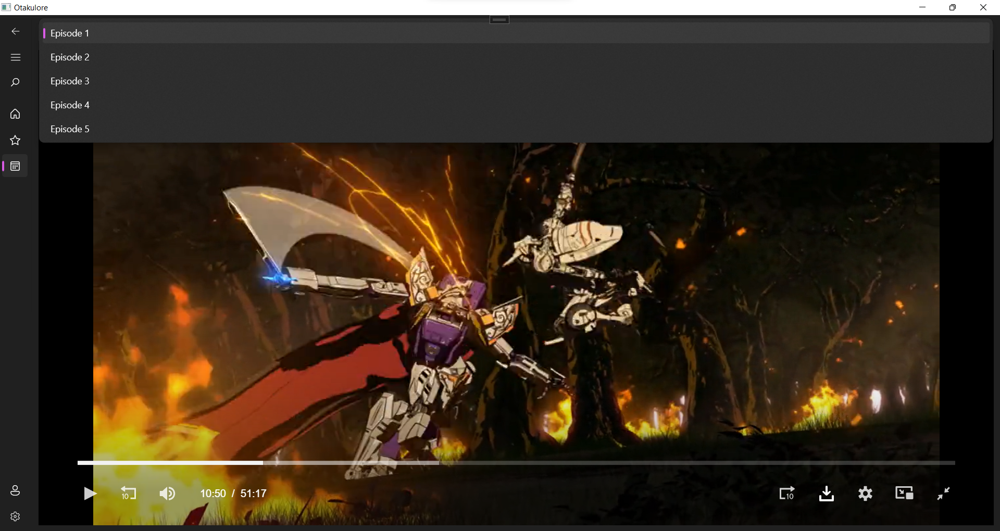

#  Otakulore

An app for tracking, watching and reading all about anime and manga!

Ever wanted to have everything in one place? Tracking your progress, watching anime, and reading manga. And so, I wanted to solve this problem with this project. This app allows you to sync with your [AniList](https://anilist.co) account and manage your library directly on the app itself, and also includes the schedules of the currently airing anime (powered by [AniChart](https://anichart.net)) so you never miss an episode, and most importantly, watch or read your favorite anime or manga from various sources without having to search each of them!

> **Note**: For this project, the development will probably be slow as I am the only one working on this project and I also need to study for my upcoming national exams this year. Sorry!

## Features

* [ ] Runs on multiple platforms; so you could watch, read and track anytime and anywhere!
  * [X] Windows (powered by the **new** [Windows App SDK](https://github.com/microsoft/WindowsAppSDK))
  * [ ] Android (planned until the stable release of [.NET MAUI](https://docs.microsoft.com/dotnet/maui/what-is-maui))
* [X] Easily track and synchronize your list with [AniList](https://anilist.co)!
* [X] Get extensive details on your favorite series; including characters, staff and more! (from [AniList](https://anilist.co))
* [X] Plan your next series to watch with the seasonal calendar (from [AniChart](https://anichart.net))!
* [X] Efficiently get access to many sources easily!
  * [X] [AnimeKisa](https://animekisa.tv) (Anime)
  * [X] [Mangakakalot](https://mangakakalot.com) (Manga)
  * [X] [Novelhall](https://novelhall.com) (Novel)
  * [ ] ... more to be added soon!

## Screenshots

