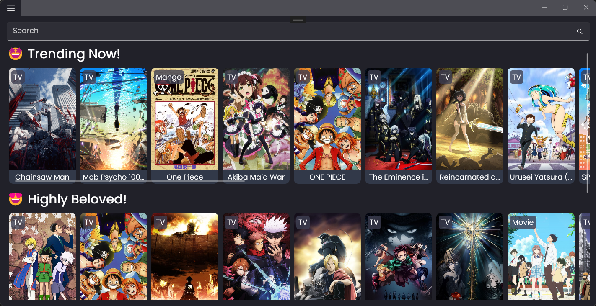
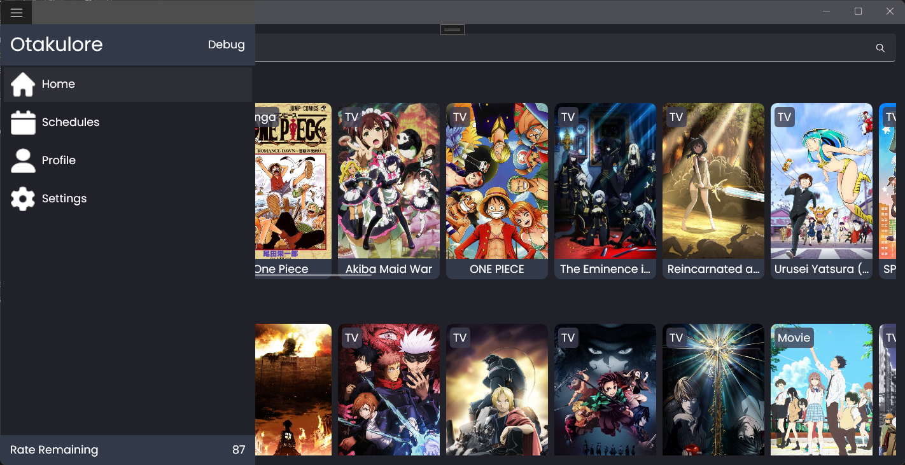
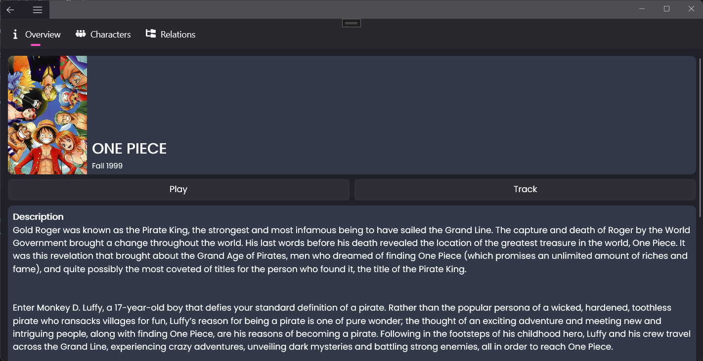
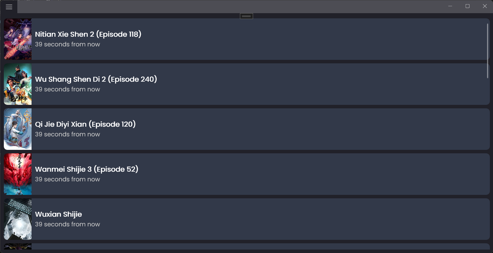
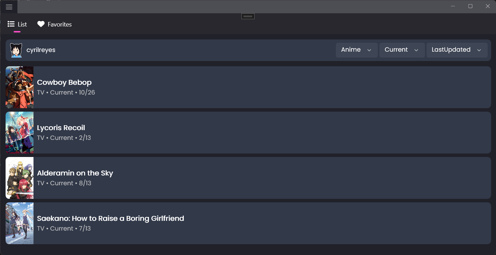
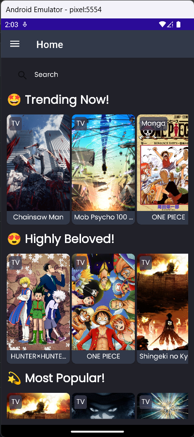
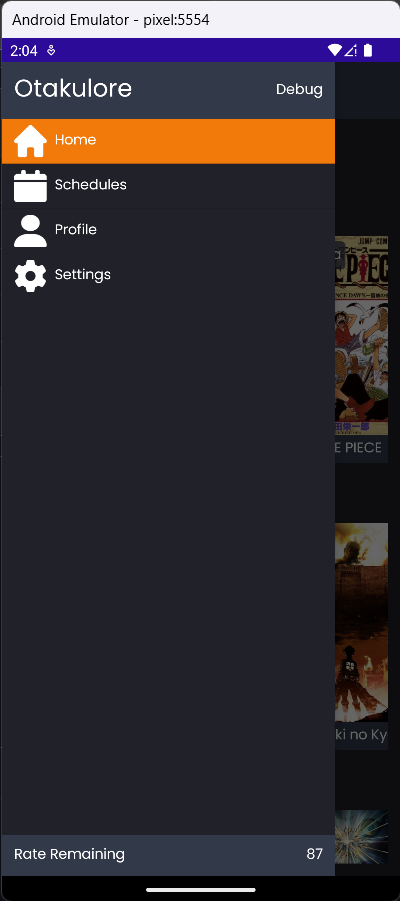
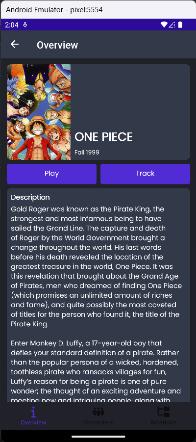
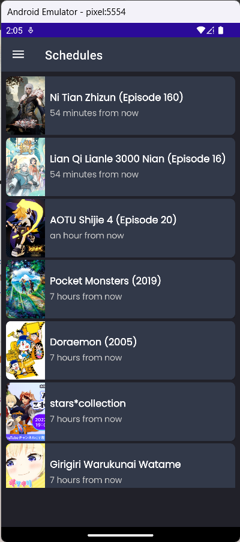
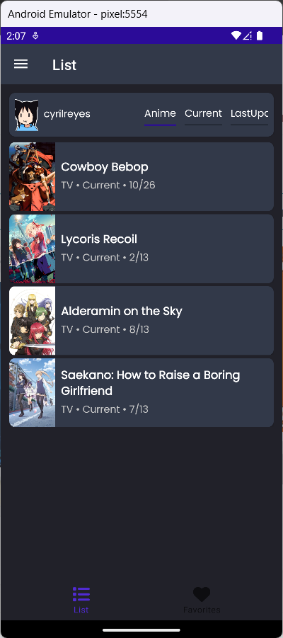

#  Otakulore

An app for tracking, watching and reading all about anime and manga!

# ⚒️ Usage

- For **Windows** users,
  1. Download `Otakulore_windows.msix` from the [releases page](https://github.com/dentolos19/Otakulore/releases)
  2. Follow this [documentation](https://learn.microsoft.com/dotnet/maui/windows/deployment/publish-cli?view=net-maui-7.0#installing-the-app) for installation
  3. Done!
- For **Android** users,
  1. Download `Otakulore_android.apk` from the [releases page](https://github.com/dentolos19/Otakulore/releases)
  2. Install the app
  3. Done!

# 📸 Screenshots

	
🪟 WinUI

	
	
	
	
	

	
📱 Android

	
	
	
	
	

