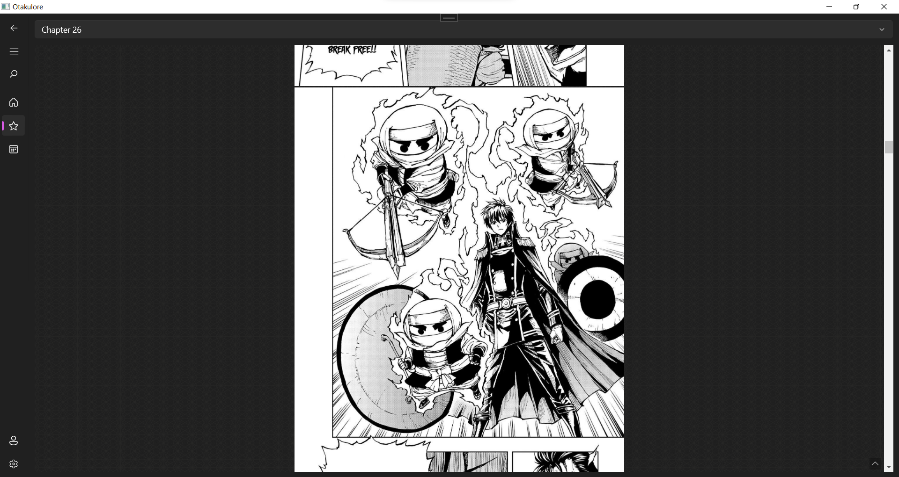
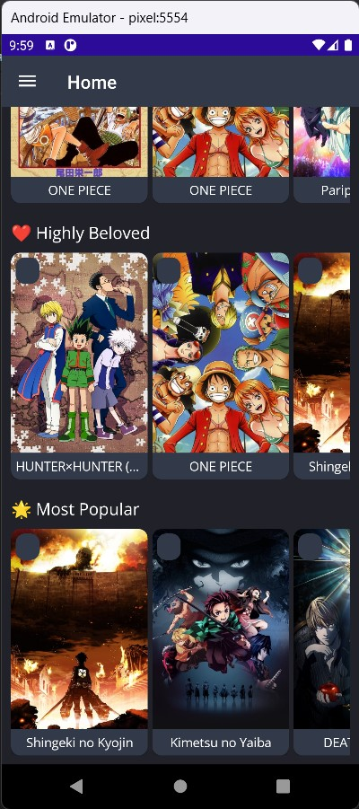
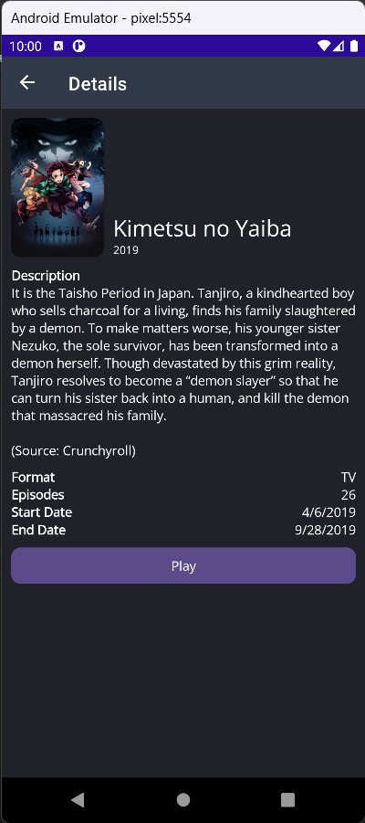
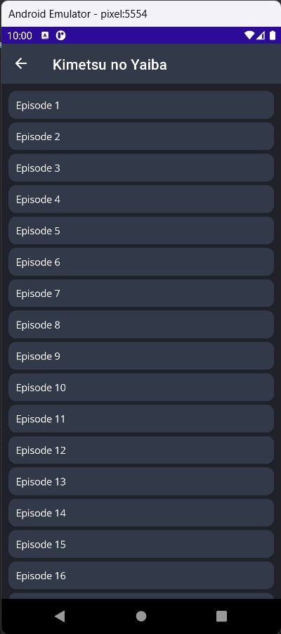
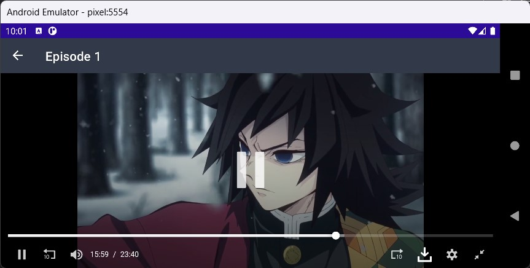

#  Otakulore

An app for tracking, watching and reading all about anime and manga!

Ever wanted to have everything in one place? Tracking your progress, watching anime, reading manga and so on. And I thought that I wanted to solve this problem, and this project came to life. This app allows you to sync with your [AniList](https://anilist.co) account and manage your library directly on the app itself, and also includes the schedules of the currently airing anime (powered by [AniChart](https://anichart.net)) so you never miss an episode, and most importantly, watch or read your favorite anime or manga from various sources without having to search each of them!

> **Note**: For this project, the development will probably be very slow as I am the only one working on this project and at the same time I will be studying for my national exams that I am taking this year (2022) so I will have very less time to work on this project.

## Features

* [X] Runs on multiple platforms; so you could watch, read and track anytime and anywhere!
  * [X] Windows (powered by [Windows App SDK](https://github.com/microsoft/WindowsAppSDK))
  * [X] Android (powered by [.NET MAUI](https://docs.microsoft.com/dotnet/maui/what-is-maui))
* [X] Easily track and manage your list directly inside the app with [AniList](https://anilist.co)!
* [X] Get extensive details on your favorite series including characters, staff and more! (from [AniList](https://anilist.co))
* [X] Plan your next series to watch with the seasonal calendar (from [AniChart](https://anichart.net))!
* [X] Efficiently get access to many sources easily!
  * [X] [Gogoanime](https://gogoanime.film) (Anime)
  * [X] [Mangakakalot](https://mangakakalot.com) (Manga)
  * [ ] [Novelhall](https://novelhall.com) (Novel)
  * [ ] ... more to be added soon!

## Screenshots

  
WinAppSdk Version

  
  
  
  
  
  
  
  

  
.NET MAUI Version (WIP)

  
  
  
  

