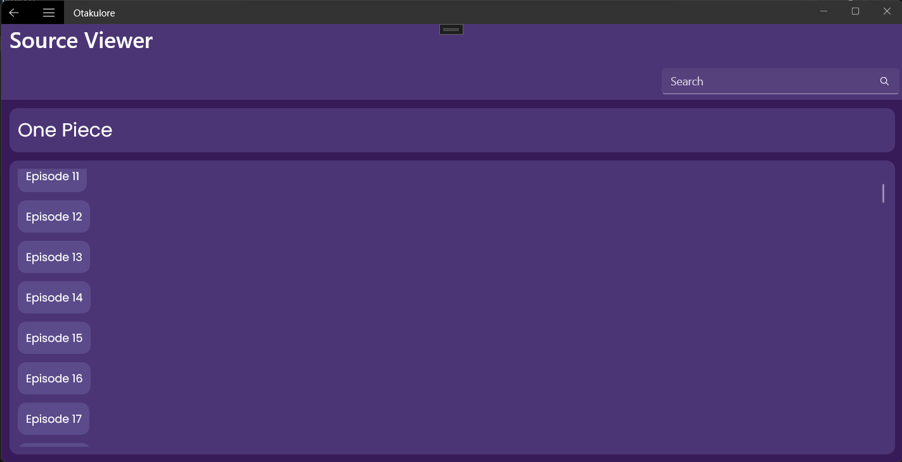
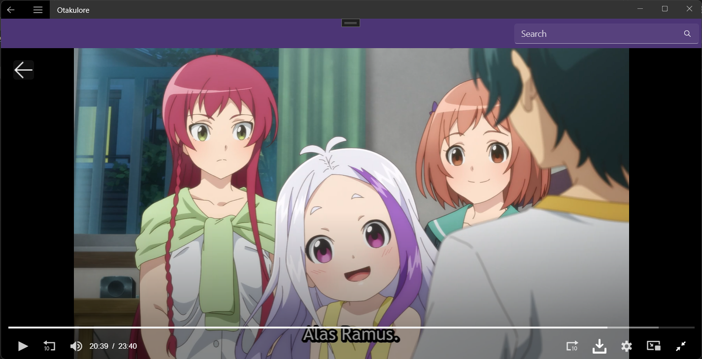
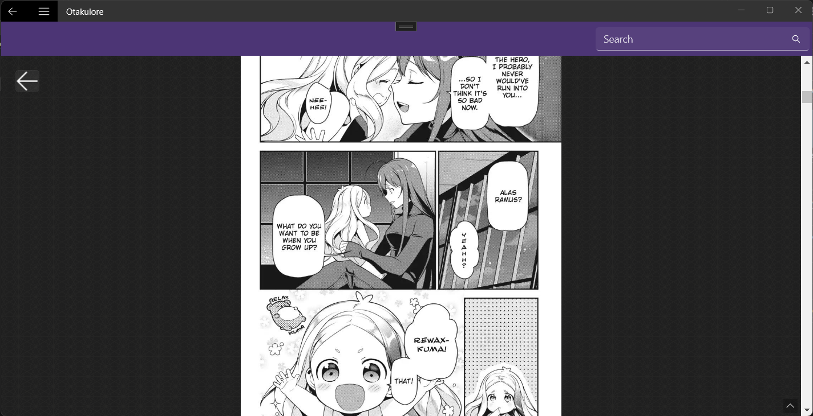

#  Otakulore

An app for tracking, watching and reading all about anime and manga!

## Usage

1. Download the respective builds from the [releases page](https://github.com/dentolos19/Otakulore/releases)
2. Extract *all* the files inside the zip file
3. Follow the steps below according to your current operating system
  - For **Windows** users,
    1. Follow this [documentation](https://docs.microsoft.com/en-us/dotnet/maui/windows/deployment/overview#installing-the-app) for installation
    2. Done!
  - For **Android** users,
    1. Install the `.apk` file
    2. Done!

## Features

- [X] Runs on multiple platforms; so you could watch, read and track anytime and anywhere!
  - [X] Windows (powered by [.NET MAUI](https://github.com/dotnet/maui)/[Windows App SDK](https://github.com/microsoft/WindowsAppSDK))
  - [X] Android (powered by [.NET MAUI](https://github.com/dotnet/maui))
- [X] Get extensive details on your favorite series including characters, staff and more! (from [AniList](https://anilist.co))
- [ ] Easily track and manage your list directly inside the app with [AniList](https://anilist.co)!
- [X] Plan your next series to watch with the seasonal calendar (from [AniChart](https://anichart.net))!
- [X] Efficiently get access to many sources easily!
  - [X] [Gogoanime](https://gogoanime.film) (Anime)
  - [X] [Mangakakalot](https://mangakakalot.com) (Manga)
  - [ ] [Novelhall](https://novelhall.com) (Novel)
  - [ ] ... more to be added soon!

## Previews

> **Note**: These previews were taken on the commitly release! So these will not mostly represent the final product.

