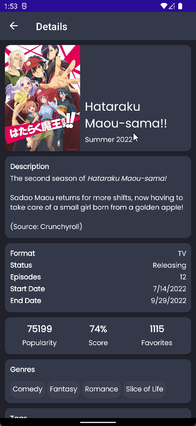
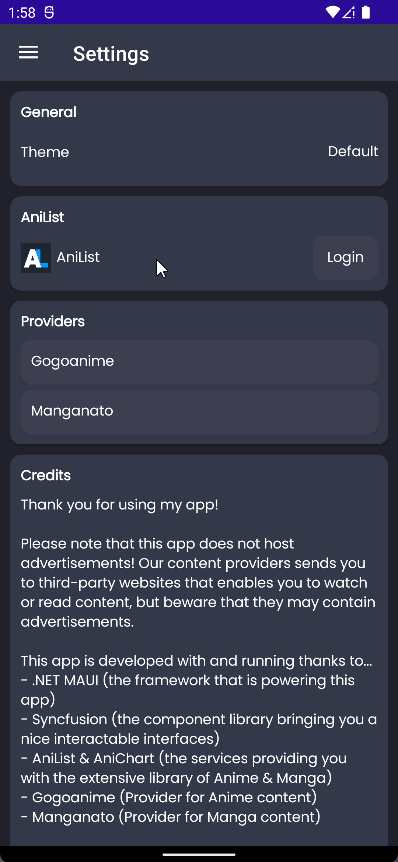
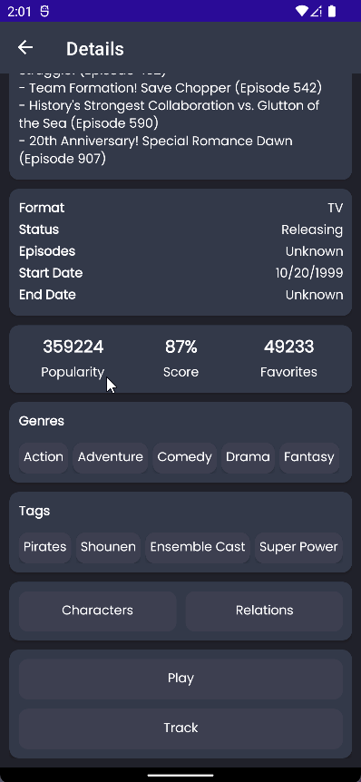

#  Otakulore

An app for tracking, watching and reading all about anime and manga!

> **Note**: This project is powered by [AniList](https://anilist.co) with the API wrapper, [AniList.NET](https://github.com/dentolos19/AniListNet).

## Usage

- For **Windows** users,
  1. Download the latest `Otakulore_windows.msix` from the [releases page](https://github.com/dentolos19/Otakulore/releases)
  2. Download and install the _latest_ [Windows App Runtime](https://docs.microsoft.com/windows/apps/windows-app-sdk/downloads#current-releases)
  3. Follow this [documentation](https://docs.microsoft.com/dotnet/maui/windows/deployment/overview#installing-the-app) for installation
  4. Done!
- For **Android** users,
  1. Download the latest `Otakulore_android.apk` from the [releases page](https://github.com/dentolos19/Otakulore/releases)
  2. Install the app
  3. Done!

## Features

- [X] Runs on multiple platforms; so you could watch, read and track anytime and anywhere!
  - [X] Windows (powered by [.NET MAUI](https://github.com/dotnet/maui)/[Windows App SDK](https://github.com/microsoft/WindowsAppSDK))
  - [X] Android (powered by [.NET MAUI](https://github.com/dotnet/maui))
- [X] Get extensive details on your favorite series including characters, staff and more! (from [AniList](https://anilist.co))
- [X] Easily track and manage your list directly inside the app with [AniList](https://anilist.co)!
- [X] Plan your next series to watch with the seasonal calendar (from [AniChart](https://anichart.net))!
- [X] Efficiently get access to many sources easily!
  - [X] [Gogoanime](https://gogoanime.film) (Anime)
  - [X] [Mangakakalot](https://mangakakalot.com) (Manga)
  - [ ] [Novelhall](https://novelhall.com) (Novel)
  - [ ] ... more to be added soon!

## Images

> **Note**: These previews were taken on the canary release! So these will not mostly represent the final product.

