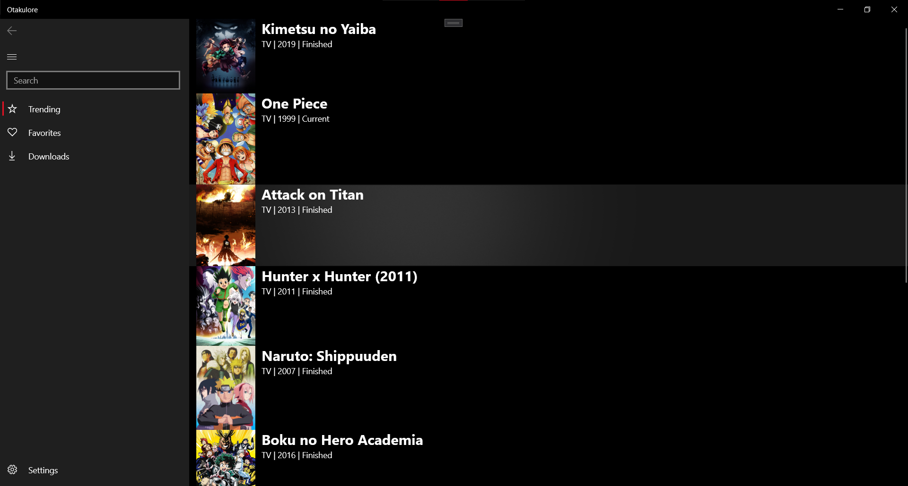
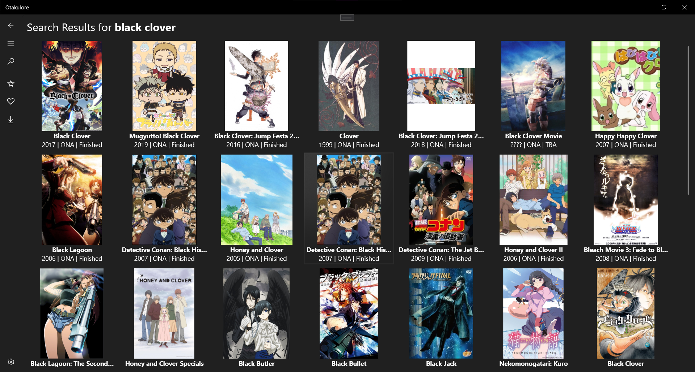
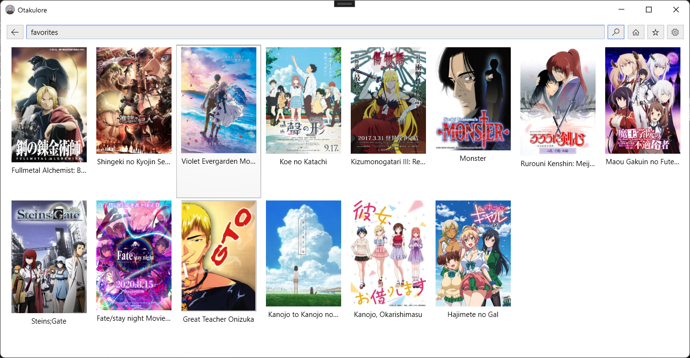
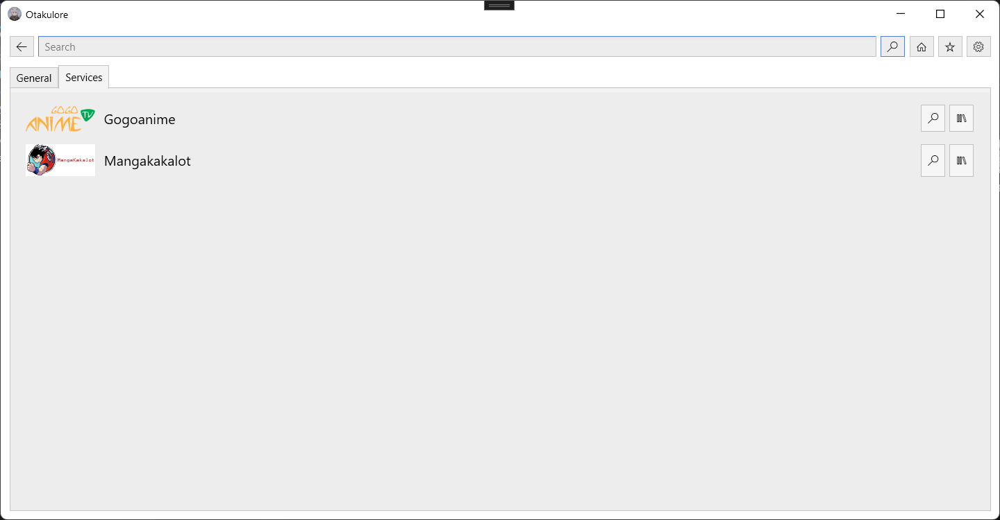
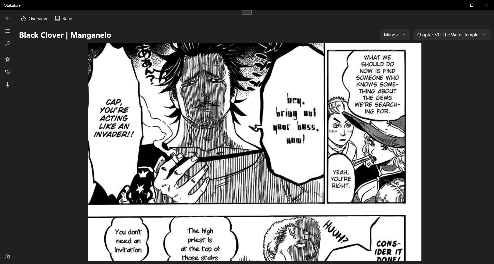
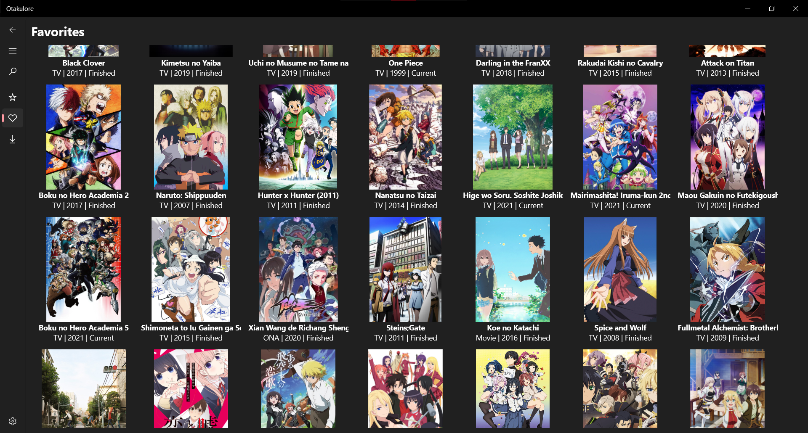

#  Otakulore

Otakulore an entertainment app for watching anime and reading manga! This project was made with learning purposes and the interest of people who loves watching anime and reading manga.

## Features

* [X] Supports anime streaming
  * [X] [AnimeKisa](https://animekisa.tv)
  * [X] [4Anime](https://4anime.to)
* [X] Supports manga reading
  * [X] [Manganelo](https://manganelo.tv)
  * [ ] [MangaDex](https://mangadex.tv)
* [X] Has a favorite system
* [ ] Has a download system (offline mode)

## Screenshots

## Usage

This project is currently work-in-progress and not available for distribution yet!