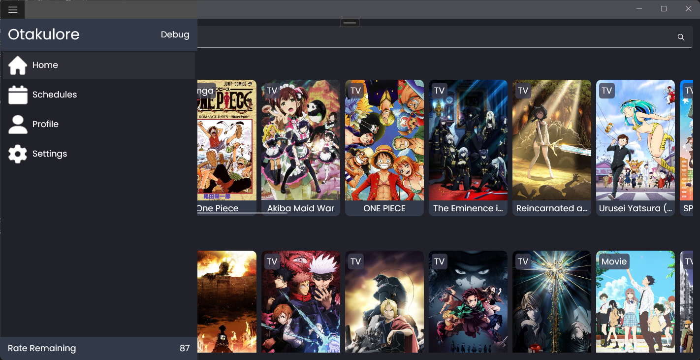
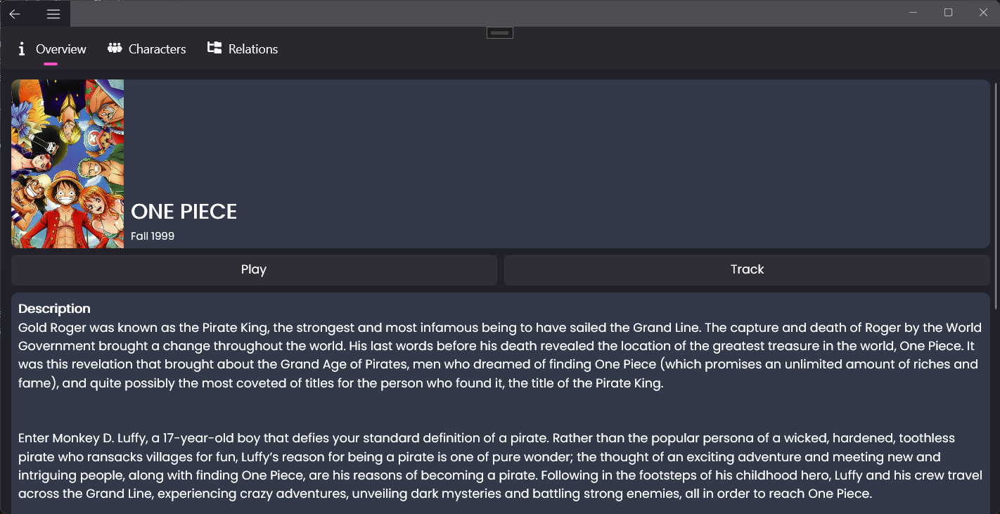
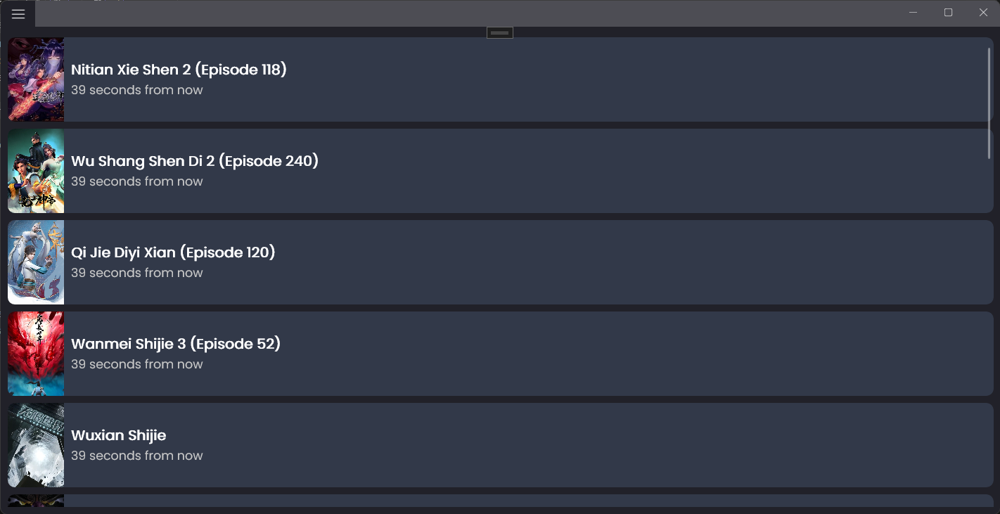
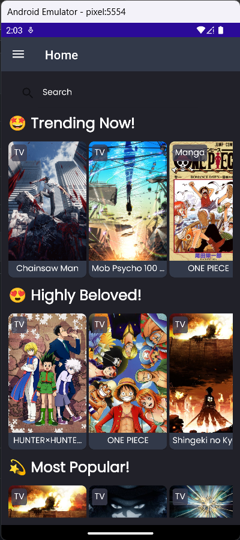
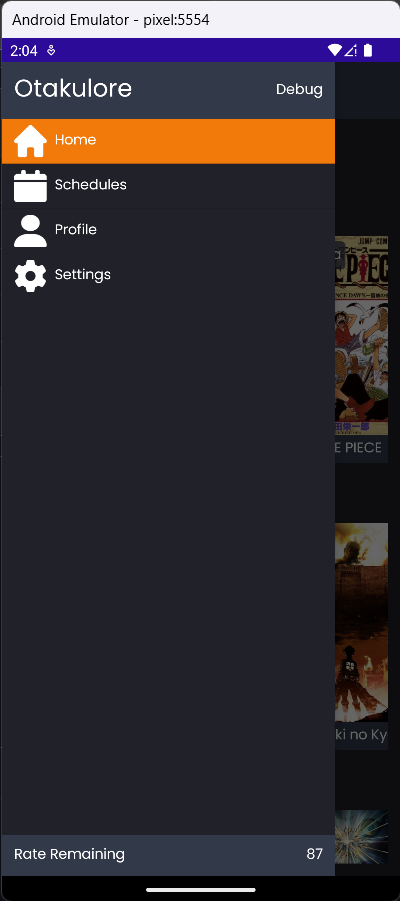
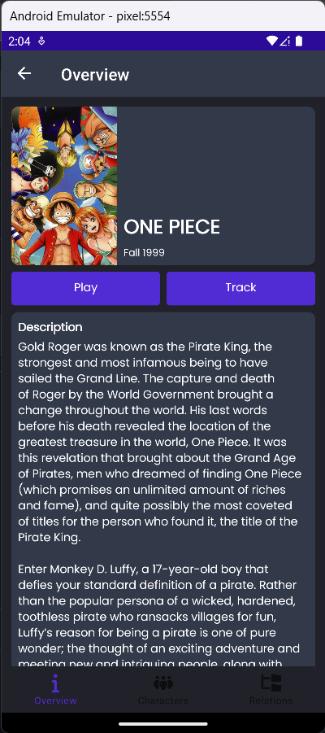
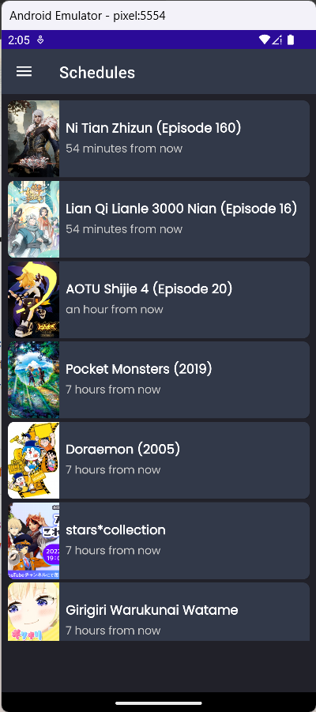
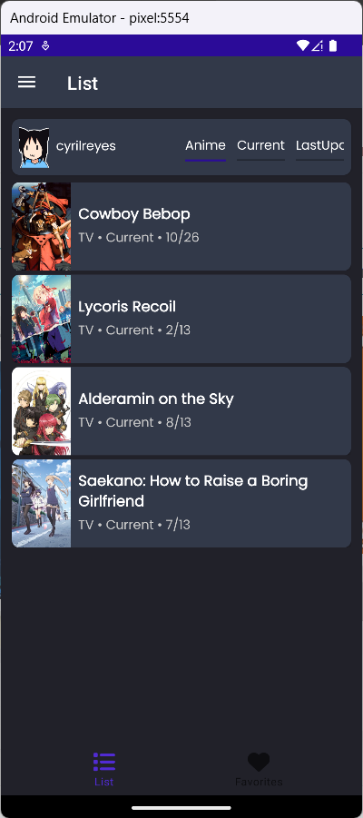

<h1>
    
    Otakulore
</h1>

An app for tracking, watching and reading all about anime and manga!

> **Fun Fact**: This project has gone through many iterations! [wpf-1](https://github.com/dentolos19/Otakulore/tree/iteration/wpf-1), [uwp](https://github.com/dentolos19/Otakulore/tree/iteration/uwp), [wpf-2](https://github.com/dentolos19/Otakulore/tree/iteration/wpf-2), [winui](https://github.com/dentolos19/Otakulore/tree/iteration/winui) and [maui-1](https://github.com/dentolos19/Otakulore/tree/iteration/maui-1)!

> **Notice**: After many moments of consideration, I have come to a decision to shut down this project. I've really enjoyed making this project, however, I am left with no motivation to continue because of not having time to focus on this project due to studying and working on other projects. I apologize to those who have supported this project along the way. There are other way better projects like [animity](https://github.com/kl3jvi/animity) for anime content and [Tachiyomi](https://github.com/tachiyomiorg/tachiyomi) for manga content. Once again, thank you for supporting the project. Hope to see you again next time!

## ⚒️ Usage

- For **Windows** users,
  1. Download `Otakulore_windows.msix` from the [releases page](https://github.com/dentolos19/Otakulore/releases)
  2. Follow this [documentation](https://learn.microsoft.com/dotnet/maui/windows/deployment/publish-cli?view=net-maui-7.0#installing-the-app) for installation
  3. Done!
- For **Android** users,
  1. Download `Otakulore_android.apk` from the [releases page](https://github.com/dentolos19/Otakulore/releases)
  2. Install the app
  3. Done!

## 📸 Screenshots

	
🪟 Windows

	
	
	
	
	

	
📱 Android

	
	
	
	
	

