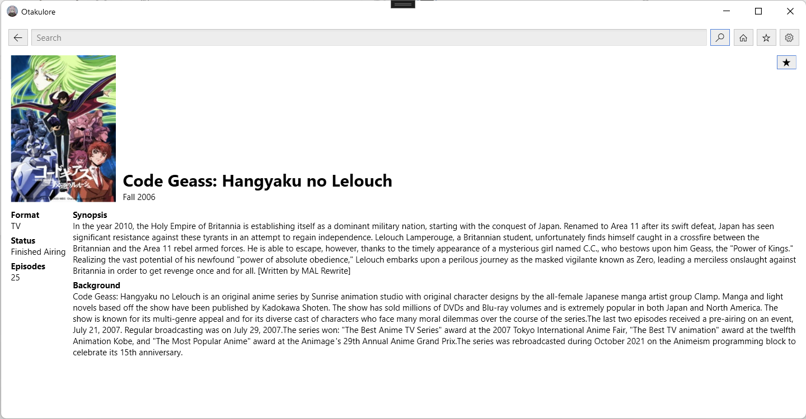

<h1 align="center">Otakulore</h1>

This project is currently work-in-progress!

* [X] Supports anime streaming
  * [X] [AnimeKisa](https://animekisa.tv)
  * [ ] [AniMixPlay](https://animixplay.to)
  * [X] [4Anime](https://4anime.to)
  * [X] [Gogoanime](https://gogoanime.pe)
* [X] Supports manga reading
  * [X] [Manganelo](https://manganelo.tv)
  * [ ] [Novelhall](https://novelhall.com) (for webnovels)
* [X] Has a favorite system
* [ ] Has a download system (offline mode)

## Screenshots

