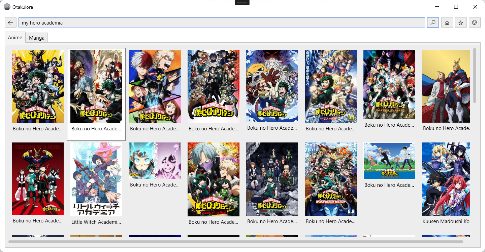

#  Otakulore

A multi-purpose app for watching anime, reading manga and feeding news!

The project has restarted its development for now, however, the development will be slow as I work on it on my free time!

> **NOTE**: This project is currently work-in-progress and doesn't contain all the planned features. See below for more info. This project will migrate to [.NET MAUI](https://docs.microsoft.com/dotnet/maui/what-is-maui) as soon as it is released. [Click here](https://github.com/dentolos19/Otakulore/tree/ec3786389e8745e9dc521eaa4282886e59b0fdee) to the previous working version before the current refreshed version.

## Features

* [ ] Supports anime streaming
  * [ ] [AnimeKisa](https://animekisa.tv)
* [ ] Supports manga reading
  * [ ] [Manganelo](https://manganelo.tv)
* [ ] Allows users to read news about anime or manga straight from one place
* [ ] Has a plugin system to enable more sources for anime and manga
* [ ] Has a download system to allow users to watch and read while being offline

## Screenshots

